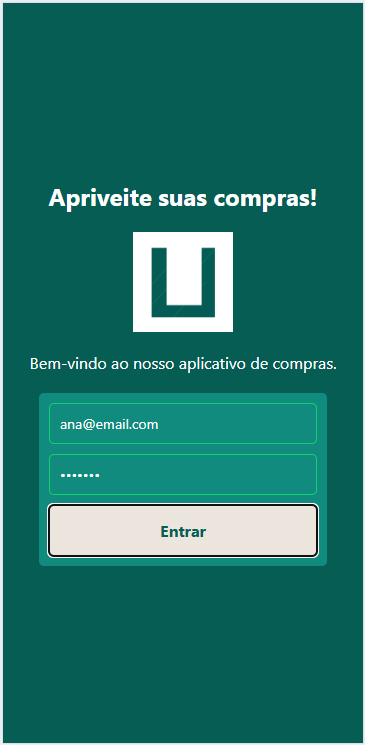
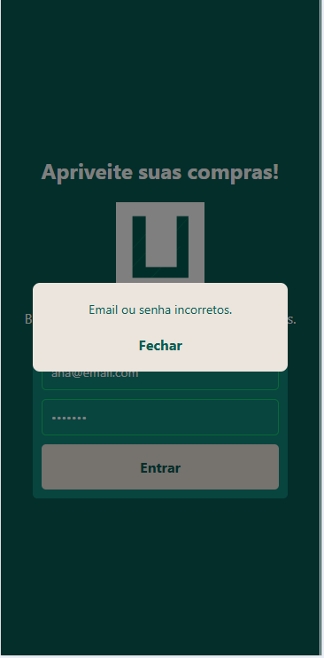
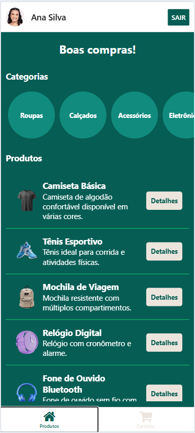
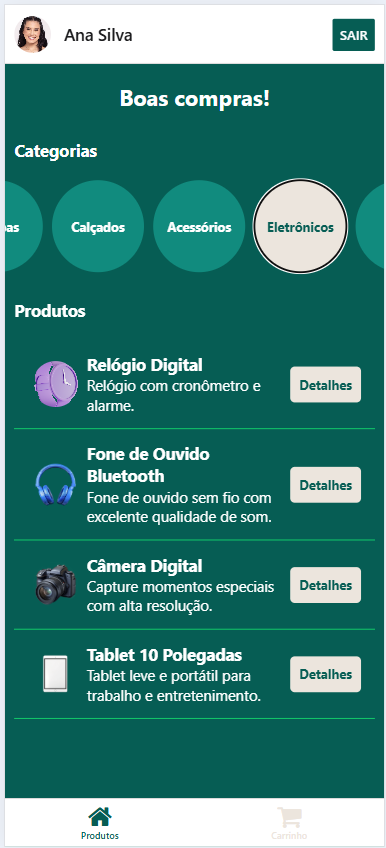
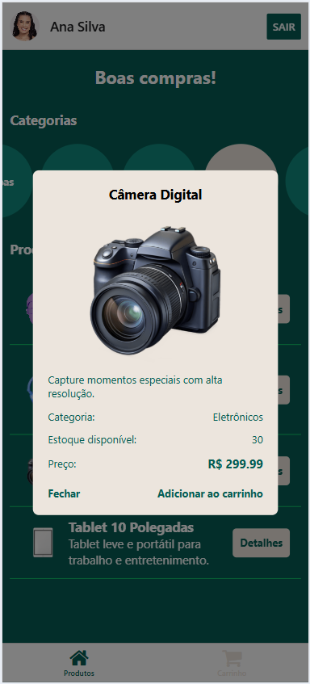
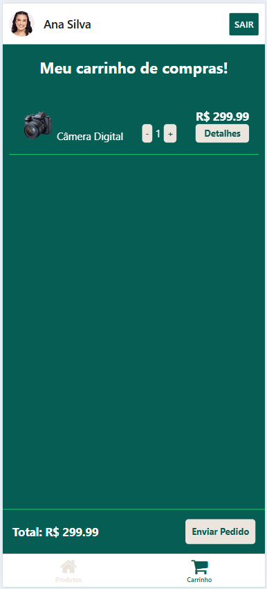
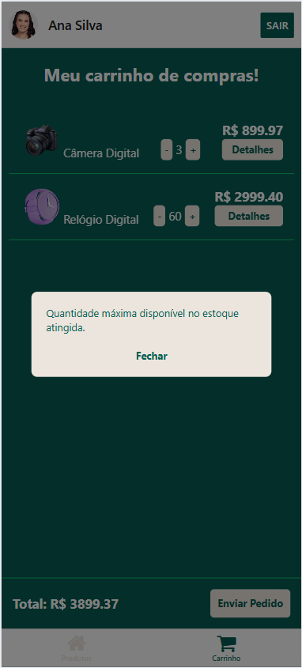

# Pedidos Carrinho WhatsApp 👋

Projeto [Expo](https://expo.dev) criado com [`create-expo-app`](https://www.npmjs.com/package/create-expo-app).

- App de carrinho de compras que envie os dados do pedido para o whatsapp.

## Tecnologias
- [React Native](https://reactnative.dev/)
- [Expo](https://expo.dev/)
- [TypeScript](https://www.typescriptlang.org/)

## Passos para executar o projeto

1. Instalar dependências

   ```bash
   npm install
   ```

2. Iniciar o app

   ```bash
   npx expo start
   ```

## Screenshots

|Coluna01|Coluna02|
|:-:|:-:|
|||
|Tela de Login|Mensagem de erro|
|||
|Tela de Produtos|Filtro por categoria|
|||
|Detalhes do produto|Aba Carrinho|
|||
|Aviso de estoque|Mensagem enviada no WhatsApp|


